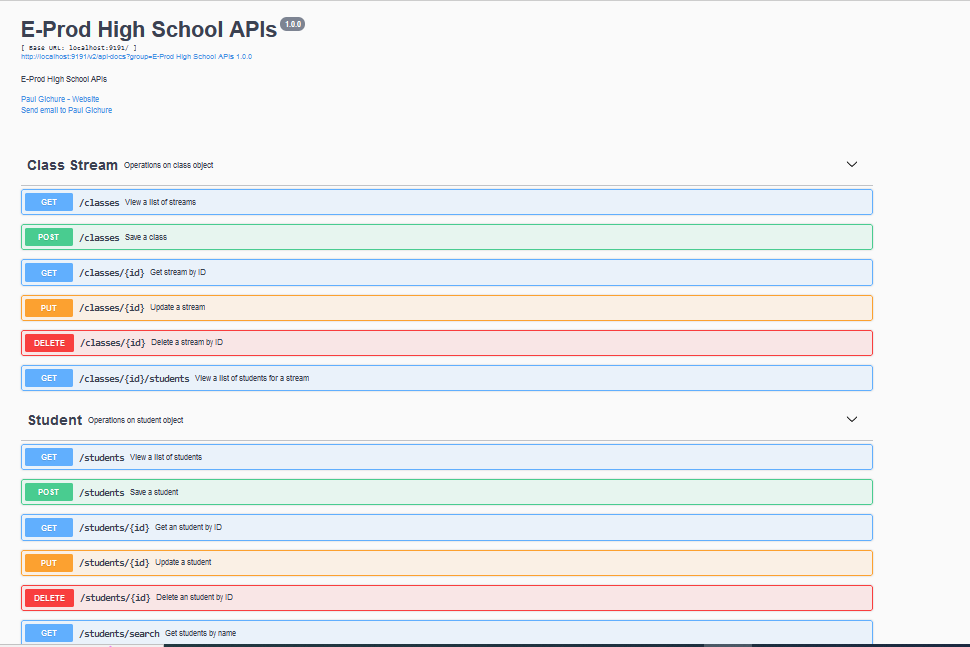

# E-Prod High School System
This web-based application provides APIs to manage Classes and Students for E-Prod High School

### Technology Stack
-  Java 17
-  Spring Boot 2.7
-  Spring Data
-  REST APIs
-  Thymeleaf
-  OpenAPi(Swagger)
-  MySQL
-  Bootstrap CSS

### Setup
-  Create MySQL user e_prod and password Eprod123#@!. Om running the application, required database and database objects shall be created.
-  Ensure you have JDK 17+ installed
-  Have Maven 3.8+ setup in the PC you are using
-  Have Git 2.0+ installed in your PC

### Run
-  Clone this repository
-  Change the working directory to cd Application
-  Run the command mvn clean spring-boot:run

### Endpoints
Browse to http://localhost:9191/swagger-ui/index.html  

-  Create a Class  
 curl -X POST "http://localhost:9191/classes" -H  "accept: application/json" -H  "Content-Type: application/json" -d "{  \"code\": \"F1A\",  \"name\": \"Form 1 A\"}"  
-  View Class  
http://localhost:9191/classes/1 
-  View all the class streams

-  View a single class stream

-  Capture student’s data
-  Assign a student to a particular class stream
-  Edit student’s data
-  Delete a student’s data
-  View a single student’s data
-  View all the students
-  View students that belong to a particular class stream.
-  Search for a student by name

### Author
Paul Gichure